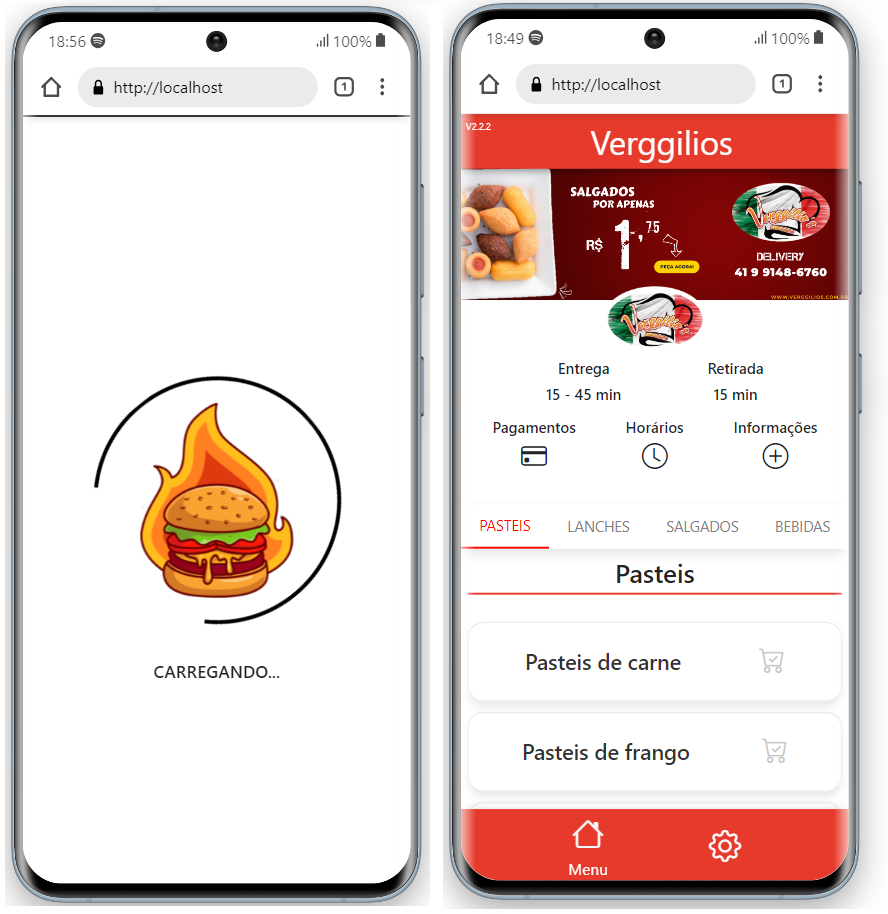
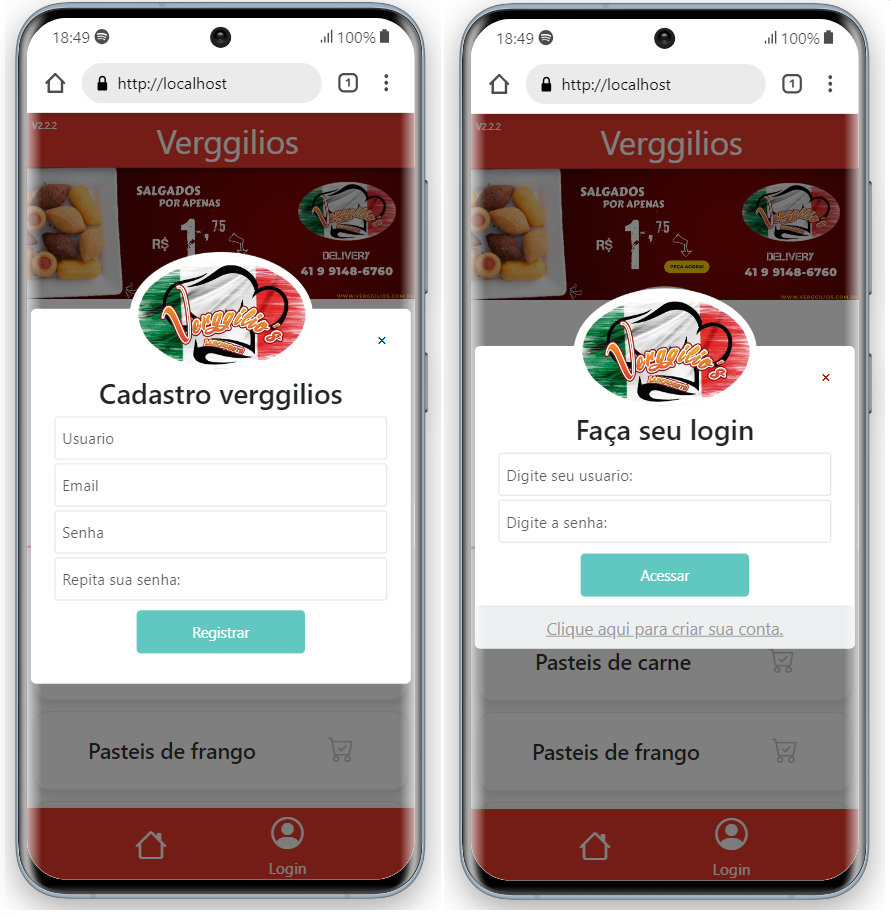
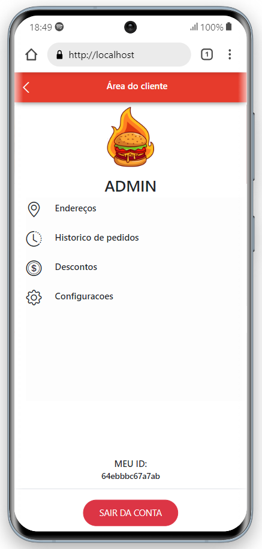
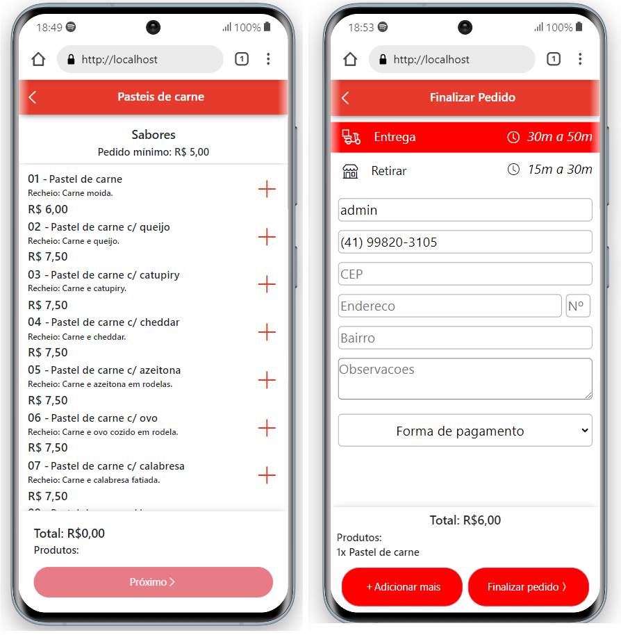
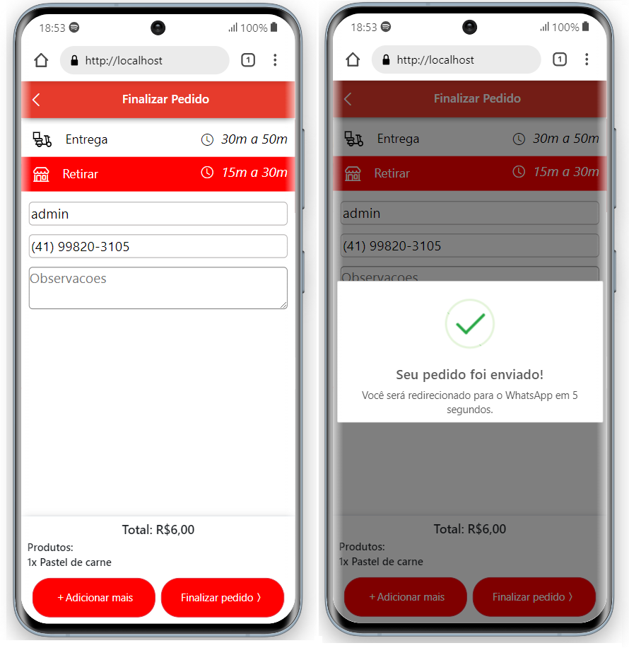
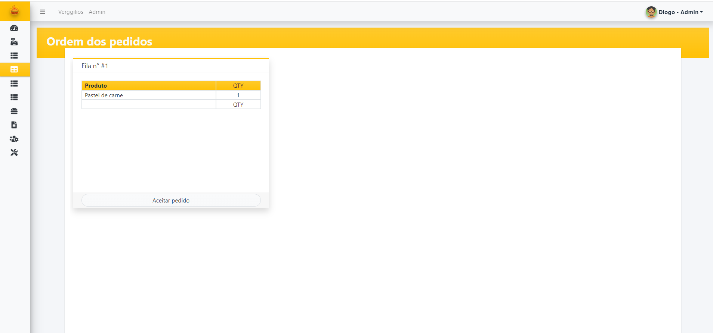

 

  

  <h3 align="center">Projeto Web - MultiPedidos</h3>

## Sobre o projeto

Projeto feito para cardapios onlines para restaurantes, lanchonetes e afins, projeto ainda em desenvolvimento com suporta a API de whatsapp e um app em desenvolvimento para motoboys (um ifood).

### Construido com

## Como funciona

Codigo fonte ainda em desenvolvimento, entre em contato para mais informações

## Projeto em imagens

=> Pagina inicial

=> Pagina de login/register

=> Perfil usuario

=> Produtos

=> Finalizando

=> Dashboard

## License

## Contato

Caso tenha alguma duvida, não exite em perguntar.