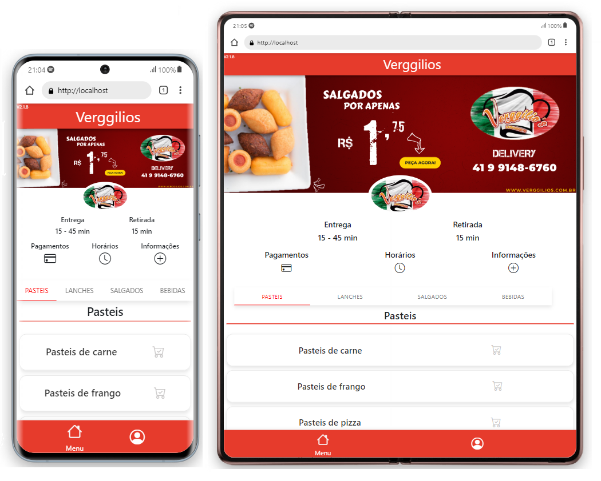
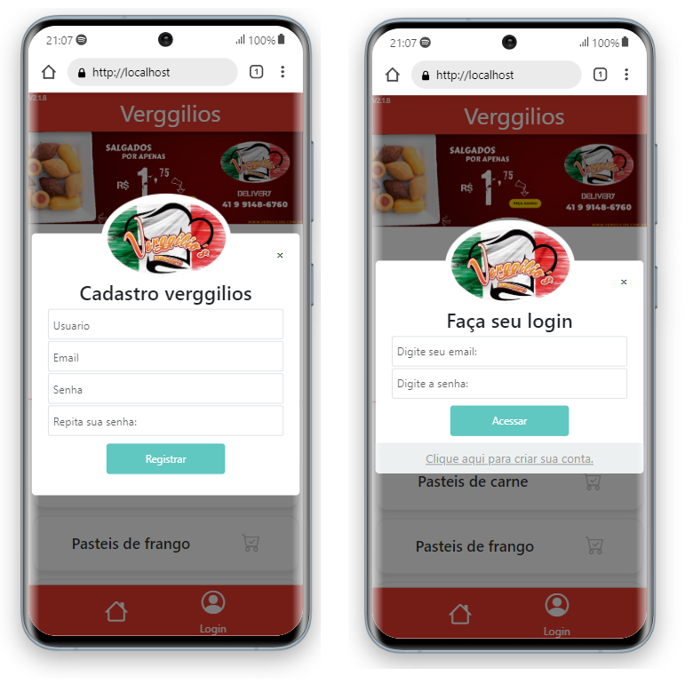

 

  

  <h3 align="center">Projeto Web - MultiPedidos</h3>

  

    Leia a documentacao para mais detalhes
     
    <a href="doc.md"><strong>Documentação»</strong></a>
     
     
    <a href="Prints/">Ver demonstração</a>
    ·
    <a href="Projeto.md">Lista de atualizações</a>
  

## Sobre o projeto

Projeto feito para cardapios onlines para restaurantes, lanchonetes e afins, projeto ainda em desenvolvimento com suporta a API de whatsapp e um app em desenvolvimento para motoboys (um ifood).

### Construido com

## Como funciona

Leia a documentação para rodar o projeto sem erros

## Projeto em imagens

Pagina inicial

Pagina de login/register

Perfil usuario

### Se sentiu interessado? baixe o projeto e veja-o por completo.

## Contribuindo

As contribuições são o que torna a comunidade de código aberto um lugar incrível para aprender, inspirar e criar. Quaisquer contribuições que você fizer são **muito apreciadas**.

Se você tiver uma sugestão para melhorar isso, de um fork ao repositório e crie uma solicitação pull. Você também pode simplesmente abrir um problema com a tag "melhoria".
Não se esqueça de dar uma estrela ao projeto! Obrigado novamente!

## License

## Contato

Caso tenha alguma duvida, não exite em perguntar.

## Gostou do projeto, me ajude doando

(<a href="#readme-top">Volte ao inicio</a>)
